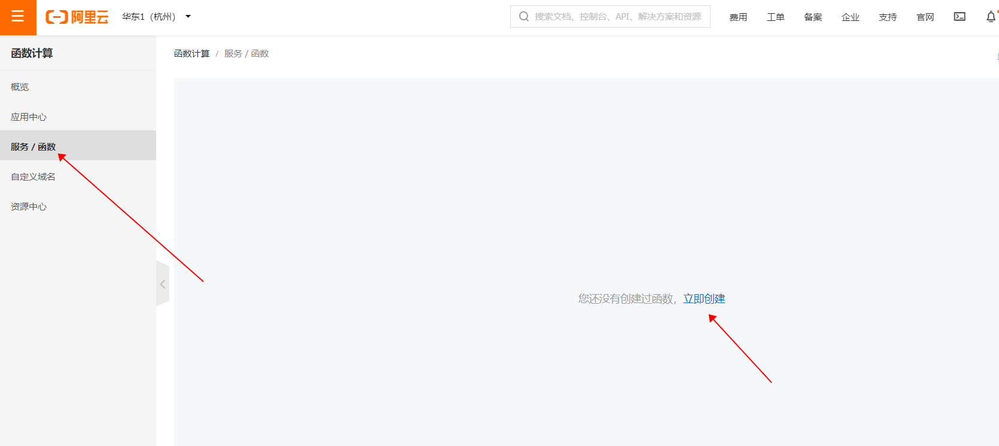
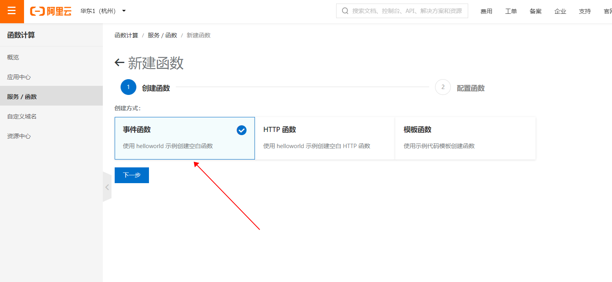
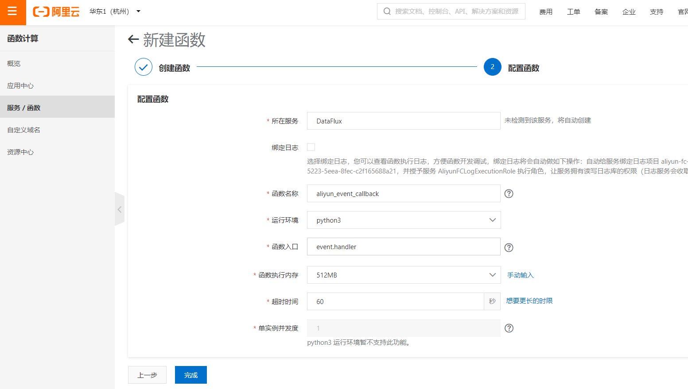
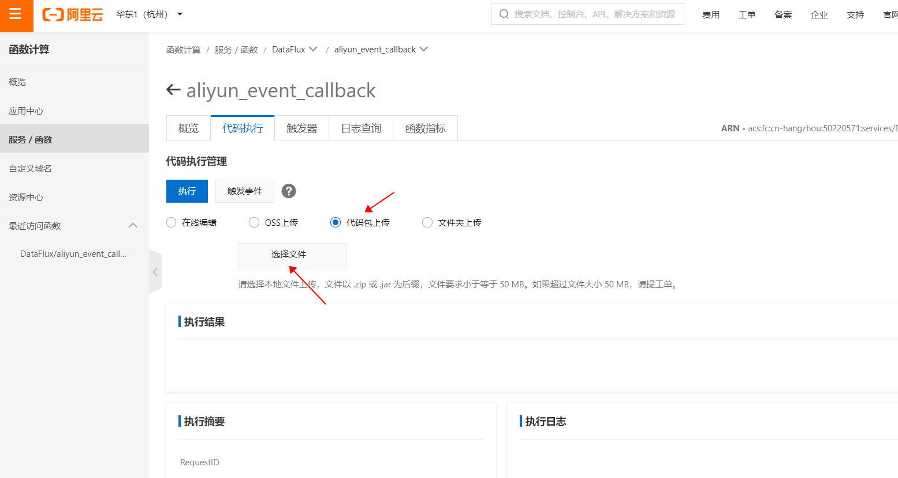
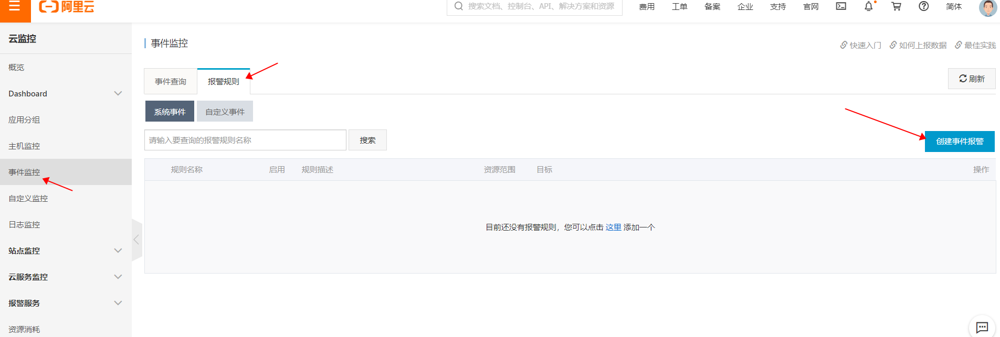
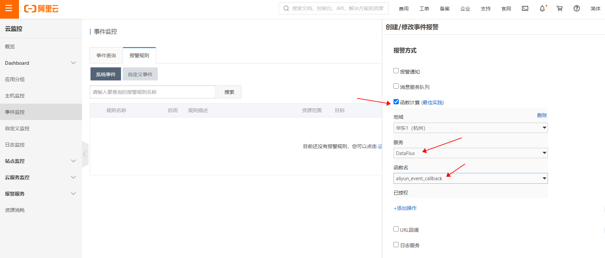

设置阿里云系统事件回调函数, 将阿里云事件数据发送到 DataFlux.

下载函数代码包 **aliyun_event.zip**: https://github.com/CloudCare/dataflux-serverless-functions/releases/download/v1.0.0/aliyun_event.zip

###函数安装

1. 进入 阿里云控制台 -> 函数计算 -> 服务/函数, 创建函数:  

  

其中 "运行环境" 设置为 **Python3**, "函数入口" 设置为 **event.handler**

2. 进入到函数配置页面, 上传代码包:  

  

###配置事件

1. 进入 阿里云控制台 -> 云监控 -> 事件监控 -> 报警规则, 点击 创建事件报警:  

  

2. 在报警事件配置页面, 选择你感兴趣的事件, 报警方式中选择函数计算, 并选择之前配置的函数:

  

完成以上设置后, 每次发生系统事件, 都会调用函数将事件信息上传到 DataFlux.

###采集指标:  

指标集名称为 **__keyevent**。  

fields和tags根据不同的事件而不同.
