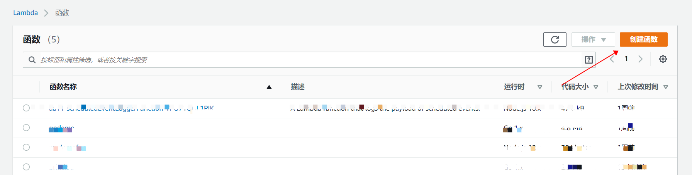
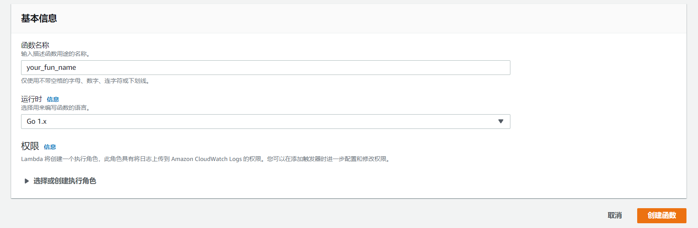
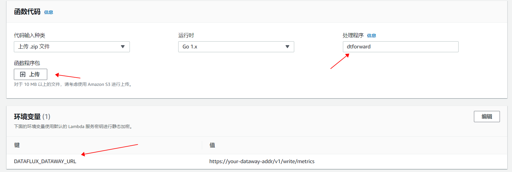
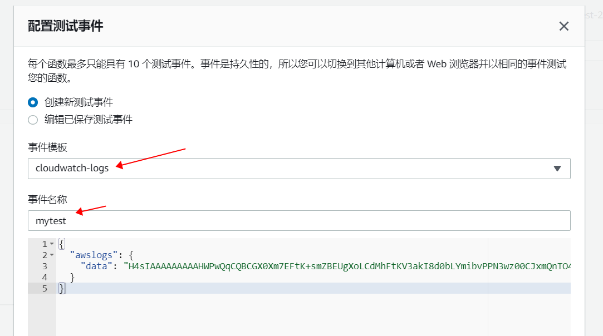
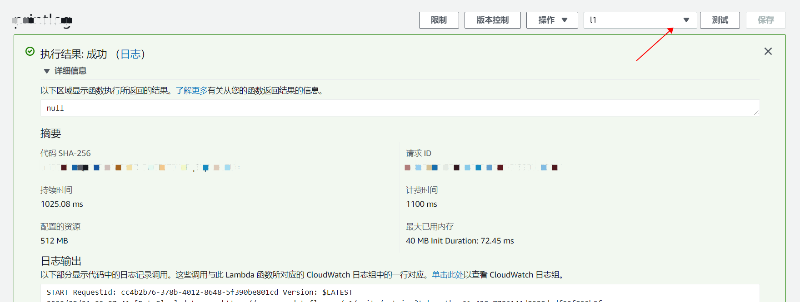
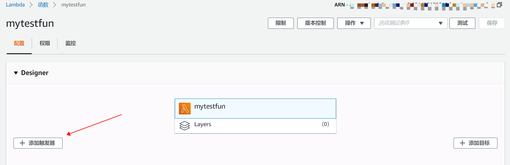
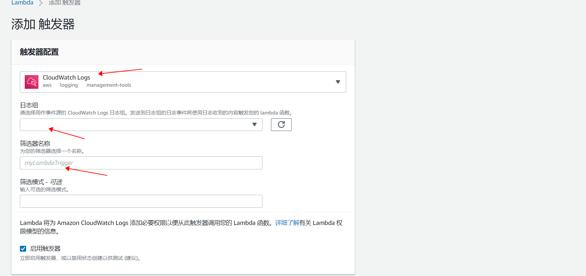

转发 AWS 流数据到 DataFlux, 目前支持 CloudWatch Logs, CloudWatch Event, S3 Event。

##Lambda函数安装:  

1. 进入 AWS Lambda 控制台，选择 **创建函数**  

2. 输入函数名, 例: my-function, 运行时选择 **Go 1.X**  

3. 创建完成后进入函数配置页面, **处理程序** 设置为"dtforward", 点击 **上传** 按钮, 上传文件 dtforward.zip, 完成后点击配置页面右上方的 **保存** 按钮。同时添加环境变量 **DATAFLUX_DATAWAY_URL** , 变量值为接收数据的dataway地址, 如果需要查看函数执行时的debug信息，可添加环境变量 **DATAFLUX_DEBUG**, 值为true。

保存后可点击右上方的 **测试** 来验证函数是否可以执行。在 **配置测试事件** 页面中选择事件模板 **cloudwatch logs**, 选择后会自动生成测试日志数据, 设置 **事件名称** 后保存。  

然后选择你配置的测试事件，点击 **测试**。  

***

##配置函数触发器 

1. 进入函数配置页面, 点击 **添加触发器**  

2. 选择触发器, 目前支持 **CloudWatch Logs**, **CloudWatch Events/EventBridge**, **S3**, 根据选择的触发器做相应配置，比如对于 "CloudWatch Logs", 需要配置作为数据源的日志组。

配置完成后，发送到日志组的日志事件将使用日志收到的内容触发您的 lambda 函数，函数负责将日志发送到 DataFlux。

##采集指标:  

###CloudWatch Logs  
每条转发的日志都记录了日志组和日志流，DataFlux以 **$log_<日志流名称>** 作为指标集名称。  

tags:  

| tag | 描述 |
| --- | ---- |
| LogGroup | 日志组名称 |
| $app | 日志流名称 |

fields:  

| 指标 | 描述 | 类型 |
| --- | ---- | ---- |
| $content | 日志内容 | string |

###CloudWatch Event  
指标集名称为 **$keyevent**。   

tags:  

| tag | 描述 |
| --- | ---- |
| DetailType | 事件的详细类型 |
| AccountID | 账号名称 |
| Region | 事件所在区域 |
| $source | 事件源 |

fields:  

| 指标 | 描述 | 类型 |
| --- | ---- | ---- |
| $title | 事件标题 | string |

###S3 Event  
指标集名称为 **$keyevent**。 

tags:  

| tag | 描述 |
| --- | ---- |
| Bucket | s3存储桶名称 |
| Region | 事件所在区域 |
| $source | 事件源 |

fields:  

| 指标 | 描述 | 类型 |
| --- | ---- | ---- |
| $title | 事件标题 | string |
| Object | s3存储对象名称 | string |
| ObjectSize | s3存储对象的大小 | int |
| ObjectVersion | s3存储对象版本 | string |
| ObjectETag | s3存储对象的ETag值 | string |
| SourceIPAddress | 发起事件的IP地址 | string |